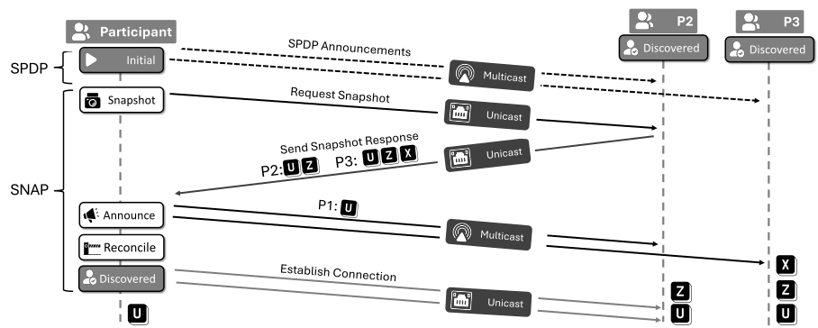
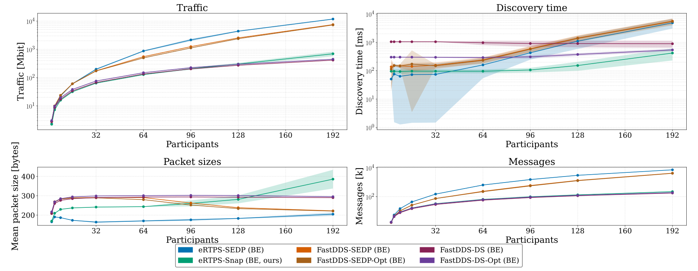

# StreamRTPS

StreamRTPS is a RTPS (Real-Time Publish-Subscribe) implementation for Linux, forked from [embeddedRTPS](https://github.com/embedded-software-laboratory/embeddedRTPS). 
On top of embeddedRTPS, StreamRTPS implements best-effort/reliable and a new transient readers and writers using standard-conform RTPS transport.
It also adds **Snap-EDP**, a scalable replacement for the standard SEDP endpoint discovery protocol, developed and evaluated at RWTH Aachen University (Chair of Embedded Software).

## Snap-EDP Discovery



Instead of SEDP's per-participant, per-endpoint exchange (`O(k)` messages per join, Snap-EDP transfers peer state in a warm-start scenario in `O(1)` messages:

- A joiner receives the entire domain state in one snapshot response from a configured participant, then announces its own endpoints in a single multicast message, resulting in 3 messages per join when a converged domain exists.
- SPDP announcements carry three added parameters: a configuration flag, the network root GUID, and a hash of the sender's own endpoints.
- Every participant verifies its view locally against those hashes. Only participants that passed this completeness gate serve snapshots.
- Cold starts elect the lowest visible GUID as root (transported through SPDP fields). Concurrent networks merge monotonically, hash mismatches trigger per-participant resyncs, and endpoint deletion and participant loss reuse the hash and SPDP lease machinery.

<details>
<summary>State machine diagram</summary>


</details>

Enable SnapEDP per domain via the `FeatureQOS`:

```cpp
rtps::Domain domain{rtps::FeatureQOS(
    rtps::DiscoveryMode::Snap, rtps::HeartbeatPolicyMode::AdaptiveFrequency)};
```

The default is `DiscoveryMode::Standard`, i.e. unmodified SEDP. Some identifiers still carry the legacy development name "gossip": the tracer config key `"discovery_mode": "gossip"` and the `soatracer-be-gossip` binary select Snap-EDP. All protocol timings are runtime-tunable atomics in `rtps::Config` (`include/rtps/config.h`); the TLA+ model checked with TLC lives in `model/` (small domains only, message loss assessed empirically).

## Results

Cold-start comparison at four endpoints per participant, embeddedRTPS with standard SEDP against StreamRTPS with Snap-EDP. Columns are the number of participants; the better value of each pair is bold.

| Metric | Discovery | 16 | 64 | 128 | 192 |
|:---|:---|---:|---:|---:|---:|
| Traffic [Mbit] | SEDP | 60.2 | 872.5 | 4,397.7 | 11,813.9 |
| | Snap-EDP | **31.4** | **127.1** | **301.8** | **695.7** |
| Messages | SEDP | 43,552 | 642,231 | 3,008,046 | 7,220,095 |
| | Snap-EDP | **16,568** | **65,226** | **133,920** | **223,885** |
| Discovery time [ms] | SEDP | **72.6** | 159.7 | 1,102.6 | 4,892.1 |
| | Snap-EDP | 96.2 | **95.9** | **152.5** | **419.7** |

The plot below also includes the FastDDS SEDP and discovery-server baselines omitted from the table:



Snap-EDP pays off in larger domains and warm joins: a single late join into 96 participants costs 0.8 Mbit and 51 ms instead of 9.4 Mbit and 133 ms. 
Below roughly 32 participants, its fixed election and reconciliation overhead makes it slightly *slower* than SEDP (96.2 vs. 72.6 ms at 16 participants) and unmodified SEDP remains a reasonable choice. 
Under 16% induced UDP loss at 128 participants, discovery latency rises moderately from 157 to 194 ms.

## Directory Layout

| Directory | Description |
|-----------|-------------|
| `StreamRTPS/include/rtps/`, `StreamRTPS/src/` | Library Implementation  |
| `StreamRTPS/src/discovery/` | SnapEDP Agent Implementation |
| `StreamRTPS/example/` | Example applications (`MessageChain`, `ReqResp`) |
| `StreamRTPS/tracer/` | SOATracer nodes (requires LTTng) |
| `StreamRTPS/tests_*/` | Unit, Snap-EDP integration (mock network), and e2e tests |
| `StreamRTPS/thirdparty/` | Bundled Micro-CDR |
| `StreamRTPS/docs/` | Diagrams (join sequence, state machine, plots) |
| `model/` | PlusCal/TLA+ model and TLC configurations |


## Building and Quick Start

Dependencies: Micro-CDR (bundled), LTTng-UST (only for tracing), nlohmann-json (only for tracer configs), CMake 3.10+, C++17.

```bash
git submodule update --init --recursive
mkdir build && cd build
cmake ..            # add -DEMBRTPS_ENABLE_TRACING=ON for tracer nodes / LTTng
make -j$(nproc)
```

Run the `ReqResp` example in two terminals:

```bash
./Responder &
./Sender
# Sender prints "Waiting 5 seconds for discovery...", then exchange statistics
```

To run any example with Snap-EDP, change its `Domain` to the `FeatureQOS` constructor shown above (the examples default to `DiscoveryMode::Standard`).

Other CMake options: `RTPS_ENABLE_PACKET_LOSS` (default ON; runtime loss injection via `UDP_PACKET_LOSS_RATE`), `EMBRTPS_BUILD_TESTS`, `EMBRTPS_SANITIZER`.

```bash
cd build/tests_unit
ctest --output-on-failure
```

## Citation and Attribution

The protocol is described in:

> D. P. Klüner, S. Kowalewski, A. Kampmann. *Snap-EDP: Scalable DDS Endpoint Discovery via Peer-State Transfers.* Manuscript under review; the LaTeX source and all evaluation figures live in the `paper/` directory of the parent SOATracer repository.

```bibtex
@article{kluner2026snapedp,
  title   = {Snap-EDP: Scalable {DDS} Endpoint Discovery via Peer-State Transfers},
  author  = {Kl{\"u}ner, David Philipp and Kowalewski, Stefan and Kampmann, Alexandru},
  year    = {2026},
  note    = {Manuscript under review}
}
```

StreamRTPS is MIT-licensed (see `LICENSE`, Copyright Lehrstuhl Informatik 11, RWTH Aachen University) and derived from [embeddedRTPS](https://github.com/embedded-software-laboratory/embeddedRTPS) by the same chair.
